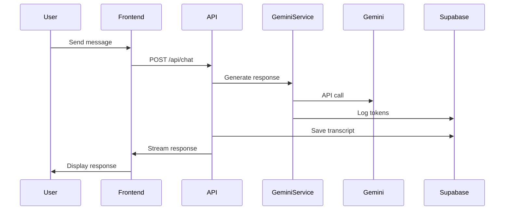
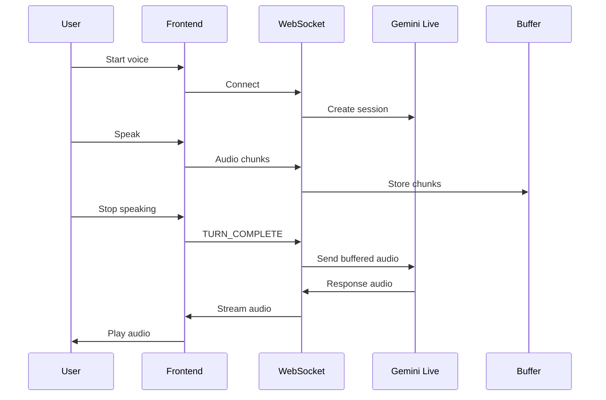
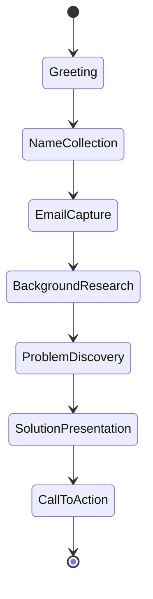

# System Architecture - F.B Consulting AI Platform

## Executive Summary

This document outlines the complete system architecture for the F.B Consulting AI Platform, a sophisticated lead generation and AI consulting system that leverages Google's Gemini AI for multimodal interactions, Supabase for data persistence, and Vercel for hosting.

## Architecture Principles

1. **Separation of Concerns**: Clear boundaries between UI, business logic, and data layers
2. **Single Source of Truth**: Centralized services for AI, email, and data management
3. **Scalability**: Distributed architecture with independent scaling of components
4. **Cost Efficiency**: Token budget management and smart caching strategies
5. **Security**: End-to-end encryption, rate limiting, and secure API patterns

## System Components

### 1. Client Layer (Frontend)

**Technology Stack:**
- Next.js 14 with App Router
- React 18 with TypeScript
- Tailwind CSS for styling
- Shadcn UI component library
- WebSocket client for real-time communication

**Key Features:**
- Server-side rendering for SEO optimization
- Progressive Web App capabilities
- Real-time voice and video interactions
- Responsive design for all devices

**Directory Structure:**
```
app/
├── (chat)/          # Chat interface and real-time features
├── admin/           # Admin dashboard
├── api/             # API routes
└── [pages]/         # Static pages
```

### 2. API Layer

**Centralized AI Service (`lib/services/gemini-service.ts`):**
- Single interface for all Gemini AI interactions
- Token estimation and budget enforcement
- Error handling and retry logic
- Support for:
  - Text generation
  - Image analysis
  - Document processing
  - ROI calculations
  - Video-to-app specifications

**API Endpoints:**
```
/api/chat                 # Main chat interface
/api/analyze-image        # Image analysis
/api/analyze-document     # Document processing
/api/calculate-roi        # ROI calculations
/api/video-to-app        # Video analysis
/api/send-lead-email     # Email service
/api/admin/*             # Admin endpoints
```

### 3. Real-Time Communication Layer

**WebSocket Server (`server/live-server.ts`):**
- Deployed separately from main application
- Direct connection to Gemini Live API
- Handles:
  - Real-time voice streaming
  - Video frame processing
  - Audio transcription
  - Multimodal sessions

**Features:**
- Session-based token budgets
- Rate limiting per IP
- Audio buffering with TURN_COMPLETE signals
- Automatic reconnection handling

### 4. Data Persistence Layer

**Supabase Database Schema:**

```sql
-- Core Tables
leads                    # Lead information and scoring
conversations           # Chat session tracking
transcripts            # Complete message history
voice_sessions         # WebSocket session data
conversation_insights  # AI-extracted insights
follow_up_tasks       # Automated follow-ups

-- Supporting Tables
activities            # System activity log
token_usage_logs     # Token usage tracking
user_budgets         # User-specific limits
meetings             # Scheduled meetings
```

**Key Relationships:**
- Leads → Conversations (1:N)
- Conversations → Transcripts (1:N)
- Conversations → Voice Sessions (1:N)
- Leads → Follow-up Tasks (1:N)

### 5. External Services

**Gemini AI (Google):**
- Primary AI provider
- Models used:
  - `gemini-2.5-flash` (general chat)
  - `gemini-2.5-flash-lite` (cost-efficient analysis)
  - `gemini-2.5-flash-preview-native-audio-dialog` (voice)

**Resend (Email):**
- Transactional email service
- Templates:
  - Welcome emails
  - Follow-up sequences
  - Reports and proposals
  - Meeting confirmations

## Data Flow

### 1. Chat Conversation Flow



### 2. Voice Session Flow



### 3. Lead Nurturing Flow



## Deployment Architecture

### Production Environment

```
┌─────────────────────────────────────────┐
│            Vercel (Edge)                │
│  - Next.js Application                  │
│  - API Routes                           │
│  - Static Assets (CDN)                  │
└─────────────────────────────────────────┘
                    │
    ┌───────────────┼───────────────┐
    ▼               ▼               ▼
┌──────────┐ ┌──────────┐ ┌──────────┐
│ Render/  │ │ Supabase │ │  Resend  │
│ Railway  │ │          │ │          │
│          │ │ Database │ │  Email   │
│WebSocket │ │   RLS    │ │   API    │
│ Server   │ │ Realtime │ │          │
└──────────┘ └──────────┘ └──────────┘
```

### Environment Configuration

**Vercel (Main App):**
```env
GEMINI_API_KEY=xxx
SUPABASE_URL=xxx
SUPABASE_ANON_KEY=xxx
SUPABASE_SERVICE_ROLE_KEY=xxx
RESEND_API_KEY=xxx
NEXT_PUBLIC_LIVE_SERVER_URL=wss://xxx
NEXT_PUBLIC_APP_URL=https://xxx
```

**WebSocket Server:**
```env
GEMINI_API_KEY=xxx
LIVE_SERVER_PORT=3001
```

## Security Measures

### 1. Authentication & Authorization
- Supabase Row Level Security (RLS)
- Service role for server-side operations
- Anonymous access for public features

### 2. Rate Limiting
- IP-based rate limiting (20 requests/minute)
- Session-based token budgets
- Daily and per-request limits

### 3. Data Protection
- HTTPS/WSS encryption in transit
- Supabase encryption at rest
- Sanitized user inputs
- No storage of sensitive AI keys in client

### 4. Budget Management
- Token counting and estimation
- Cost tracking per session
- Automatic cutoffs at limits
- Demo mode restrictions

## Monitoring & Observability

### 1. Application Monitoring
- Vercel Analytics for performance
- Error tracking in production
- API response time monitoring

### 2. Cost Monitoring
- Token usage logs in Supabase
- Daily cost reports
- Alert thresholds for unusual usage

### 3. User Analytics
- Lead conversion tracking
- Conversation stage analytics
- Feature usage metrics

## Scaling Strategy

### 1. Horizontal Scaling
- Vercel automatic scaling for main app
- WebSocket server clustering capability
- Supabase connection pooling

### 2. Performance Optimization
- Edge caching for static assets
- Database query optimization
- Lazy loading of components
- Image optimization

### 3. Cost Optimization
- Model selection based on task
- Response caching where appropriate
- Batch processing for analytics

## Disaster Recovery

### 1. Backup Strategy
- Supabase automatic daily backups
- Point-in-time recovery capability
- Export functionality for leads

### 2. Failover Plan
- Multi-region deployment capability
- Graceful degradation for AI features
- Offline mode for critical functions

## Future Enhancements

### Phase 1 (Q1 2025)
- [ ] Implement conversation analytics dashboard
- [ ] Add automated follow-up sequences
- [ ] Enhance voice recognition accuracy
- [ ] Add multi-language support

### Phase 2 (Q2 2025)
- [ ] Integrate additional AI models
- [ ] Add video call capabilities
- [ ] Implement advanced lead scoring
- [ ] Build partner API

### Phase 3 (Q3 2025)
- [ ] Mobile native applications
- [ ] White-label solution
- [ ] Advanced reporting suite
- [ ] AI model fine-tuning

## Maintenance Procedures

### Daily Tasks
- Monitor error logs
- Check token usage
- Review lead conversions

### Weekly Tasks
- Database optimization
- Security updates
- Performance review

### Monthly Tasks
- Cost analysis
- Feature usage audit
- Backup verification

## Support & Documentation

### Developer Resources
- API documentation: `/docs/api`
- Component library: `/docs/components`
- Database schema: `/docs/database`

### Operational Guides
- Deployment guide: `DEPLOYMENT_GUIDE.md`
- Troubleshooting: `TROUBLESHOOTING.md`
- Security policies: `SECURITY.md`

## Contact & Escalation

**Development Team:**
- Lead: development@fbconsulting.ai
- Emergency: +1-XXX-XXX-XXXX

**Infrastructure:**
- Vercel Support: Dashboard tickets
- Supabase Support: support@supabase.io
- Resend Support: support@resend.com

---

Last Updated: January 21, 2025
Version: 2.0.0